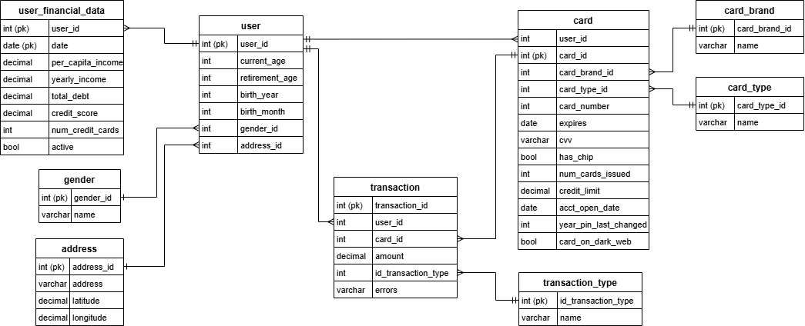
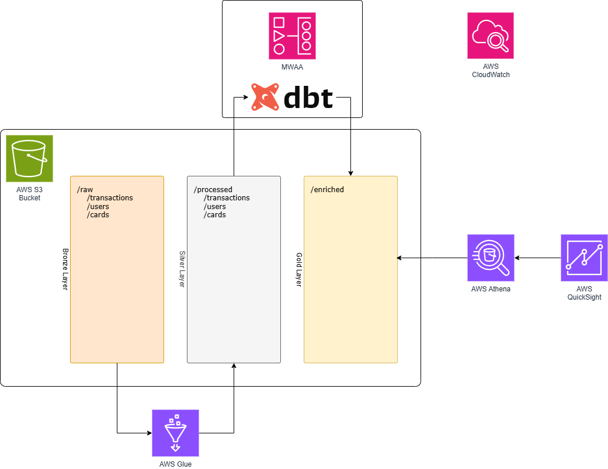

# nequi-data-engineer

- [nequi-data-engineer](#nequi-data-engineer)
  - [Paso 1: Alcance del proyecto y captura de datos](#paso-1-alcance-del-proyecto-y-captura-de-datos)
    - [Identificación y recopilación de datos](#identificación-y-recopilación-de-datos)
      - [**1. Users Data (`users_data.csv`)**](#1-users-data-users_datacsv)
      - [**2. Transactions Data (`transactions_data.csv`)**](#2-transactions-data-transactions_datacsv)
      - [**3. Cards Data (`cards_data.csv`)**](#3-cards-data-cards_datacsv)
    - [Motivación para la selección de estos datos](#motivación-para-la-selección-de-estos-datos)
    - [Casos de uso final de los datos](#casos-de-uso-final-de-los-datos)
      - [**1. Análisis de comportamiento del cliente**](#1-análisis-de-comportamiento-del-cliente)
      - [**2. Evaluación financiera y detección de riesgos**](#2-evaluación-financiera-y-detección-de-riesgos)
    - [Objetivo](#objetivo)
  - [Paso 2: Explorar y evaluar los datos (EDA)](#paso-2-explorar-y-evaluar-los-datos-eda)
    - [Resultados de la exploración](#resultados-de-la-exploración)
      - [**1. Tabla `cards_data`**](#1-tabla-cards_data)
      - [**2. Tabla `users_data`**](#2-tabla-users_data)
      - [**3. Tabla `transactions_data`**](#3-tabla-transactions_data)
    - [Pasos necesarios para la limpieza de datos](#pasos-necesarios-para-la-limpieza-de-datos)
      - [**Manejo de valores faltantes**](#manejo-de-valores-faltantes)
      - [**Eliminación de duplicados**](#eliminación-de-duplicados)
      - [**Corrección de errores de formato**](#corrección-de-errores-de-formato)
      - [**Validaciones lógicas**](#validaciones-lógicas)
  - [Paso 3: Definir el modelo de datos](#paso-3-definir-el-modelo-de-datos)
    - [1. Modelo de datos conceptual](#1-modelo-de-datos-conceptual)
      - [**Modelo conceptual:**](#modelo-conceptual)
      - [**Relaciones clave:**](#relaciones-clave)
      - [**Justificación del modelo**](#justificación-del-modelo)
    - [2. Arquitectura Propuesta del Pipeline de Datos](#2-arquitectura-propuesta-del-pipeline-de-datos)
      - [**Componentes de la Arquitectura**](#componentes-de-la-arquitectura)
        - [**1. AWS S3 (Data Lake)**](#1-aws-s3-data-lake)
        - [**2. AWS Glue**](#2-aws-glue)
        - [**3. MWAA con DBT**](#3-mwaa-con-dbt)
        - [**4. AWS Athena**](#4-aws-athena)
        - [**5. AWS CloudWatch**](#5-aws-cloudwatch)
      - [**Flujo de Datos**](#flujo-de-datos)
      - [**Beneficios de esta Arquitectura**](#beneficios-de-esta-arquitectura)
    - [3. Actualización de los datos](#3-actualización-de-los-datos)
  - [Paso 4: Ejecutar la ETL](#paso-4-ejecutar-la-etl)
    - [Diccionario de Datos](#diccionario-de-datos)
      - [**Tabla: transactions (Transacciones)**](#tabla-transactions-transacciones)
      - [**Tabla: users (Usuarios)**](#tabla-users-usuarios)
      - [**Tabla: cards (Tarjetas)**](#tabla-cards-tarjetas)
  - [Paso 5: Escenarios Alternativos](#paso-5-escenarios-alternativos)
    - [1. Si los datos se incrementaran en 100x](#1-si-los-datos-se-incrementaran-en-100x)
    - [2. Si las tuberías se ejecutaran diariamente en una ventana de tiempo específica](#2-si-las-tuberías-se-ejecutaran-diariamente-en-una-ventana-de-tiempo-específica)
    - [3. Si la base de datos necesitara ser accedida por más de 100 usuarios funcionales](#3-si-la-base-de-datos-necesitara-ser-accedida-por-más-de-100-usuarios-funcionales)
    - [4. Si se requiere hacer analítica en tiempo real, ¿cuáles componentes cambiarían en la arquitectura propuesta?](#4-si-se-requiere-hacer-analítica-en-tiempo-real-cuáles-componentes-cambiarían-en-la-arquitectura-propuesta)

## Paso 1: Alcance del proyecto y captura de datos

### Identificación y recopilación de datos

Para llevar a cabo este proyecto, se han identificado tres conjuntos de datos clave provenientes de un entorno bancario. Estos datos contienen información relevante sobre usuarios, transacciones y tarjetas, lo que permite abordar diferentes casos de uso relacionados con análisis de comportamiento y evaluación financiera. Los datos fueron obtenidos de la plataforma Kaggle y se pueden encontrar en:

<https://www.kaggle.com/datasets/computingvictor/transactions-fraud-datasets?select=users_data.csv>

Los datos fueron recopilados durante la decada de los 2010.

A continuación, se describen los archivos disponibles:

#### **1. Users Data (`users_data.csv`)**

Este archivo contiene información demográfica y financiera de los clientes. Algunas de las columnas más destacadas incluyen:

- `id`: Identificador único del cliente.
- `current_age`: Edad actual del cliente.
- `retirement_age`: Edad estimada de retiro.
- `yearly_income`: Ingreso anual del cliente.
- `credit_score`: Puntuación crediticia.
- `num_credit_cards`: Número total de tarjetas de crédito asociadas.

**Uso principal:**  
Este archivo brinda información relevante para analizar el perfil financiero de los clientes y realizar segmentaciones basadas en edad, ingresos y comportamiento crediticio.

---

#### **2. Transactions Data (`transactions_data.csv`)**

Este archivo registra las transacciones realizadas por los clientes, incluyendo detalles sobre los montos, ubicación de los comerciantes y posibles errores en las transacciones. Las columnas clave incluyen:

- `id`: Identificador único de la transacción.
- `date`: Fecha de la transacción.
- `client_id`: Identificador del cliente asociado.
- `amount`: Monto de la transacción.
- `merchant_city` y `merchant_state`: Ubicación del comerciante.

**Uso principal:**  
Proporciona información granular para analizar el comportamiento de gasto, patrones de transacción y posibles anomalías o errores.

---

#### **3. Cards Data (`cards_data.csv`)**

Este archivo incluye información sobre las tarjetas de crédito y débito emitidas a los clientes, como límites de crédito y características de seguridad. Entre las columnas más relevantes están:

- `id`: Identificador único de la tarjeta.
- `client_id`: Identificador del cliente asociado.
- `card_type`: Tipo de tarjeta (crédito o débito).
- `credit_limit`: Límite de crédito asignado.
- `card_on_dark_web`: Indicador de si la tarjeta ha sido detectada en mercados ilícitos.

**Uso principal:**  
Ayuda a evaluar el perfil financiero del cliente y detectar posibles riesgos asociados a tarjetas comprometidas.

---

### Motivación para la selección de estos datos

La principal motivación para utilizar este conjunto de datos es su relación con posibles procesos dentro de Nequi, ya que se busca utilizar datos relacionados con la banca y transacciones.

**Formato de los datos:**  
Los archivos están en formato CSV y serán almacenados en un bucket de **AWS S3** para facilitar su procesamiento y acceso mediante servicios como **AWS Glue** y **Athena**.

### Casos de uso final de los datos

El propósito de este proyecto es preparar los datos para su integración en casos de uso estratégicos, asegurando que las transformaciones y consolidaciones necesarias se completen hasta el final de la tubería de datos. A continuación, se describen los principales casos de uso finales hacia los cuales se orientará la preparación de los datos:

---

#### **1. Análisis de comportamiento del cliente**

Preparar los datos necesarios para habilitar futuros análisis de comportamiento del cliente. Estos análisis permitirán:

- Facilitar la **segmentación de clientes** basada en datos demográficos y financieros.
- Brindar una base sólida para modelos predictivos de **churn** (deserción de clientes).
- Proveer datos organizados para diseñar **recomendaciones personalizadas** según el historial de consumo.

---

#### **2. Evaluación financiera y detección de riesgos**

Preparar los datos necesarios para que se puedan desarrollar sistemas de monitoreo y evaluación financiera. Esto incluye:

- Consolidar información sobre transacciones para detectar posibles anomalías.
- Centralizar indicadores como `card_on_dark_web` y `credit_score` para la evaluación de riesgos.
- Proveer datos organizados sobre clientes y tarjetas para facilitar el desarrollo de reportes y análisis futuros.

---

### Objetivo

El propósito de este proyecto es la construcción de una tubería de datos que permita:

- La integración y transformación de los datos en un formato coherente y centralizado.
- La entrega de datos listos para ser utilizados en análisis operativos y estratégicos.
- La garantía de que los datos sean accesibles y consistentes a través de recursos como **AWS S3** y consultas en **AWS Athena**.

---

## Paso 2: Explorar y evaluar los datos (EDA)

Para realizar la exploración de los datos, se optó por trabajar en un notebook de Jupyter, permitiendo verificar el estado de los datos directamente desde la fuente. El notebook utilizado para el análisis se encuentra disponible en la carpeta **eda**.

### Resultados de la exploración

A continuación, se detallan los hallazgos de la exploración de las tres tablas principales del dataset:

#### **1. Tabla `cards_data`**

- No se encontraron valores nulos en ninguna columna.
- No se detectaron registros duplicados.
- Todas las columnas cumplen con el tipo de dato esperado.
- No se identificaron problemas estructurales o de calidad en esta tabla.

#### **2. Tabla `users_data`**

- Al igual que la tabla `cards_data`, no presenta valores nulos ni duplicados.
- Los datos cumplen con los formatos necesarios, incluyendo los campos numéricos y categóricos.
- La tabla está en condiciones óptimas para continuar con los siguientes pasos del proyecto.

#### **3. Tabla `transactions_data`**

- A pesar del volumen de datos (más de 13 millones de registros), la tabla está en buenas condiciones generales.
- No se encontraron registros duplicados.
- Las columnas relevantes no contienen valores nulos; sin embargo, algunas columnas opcionales presentan valores faltantes permitidos.
- Todas las columnas cumplen con los formatos esperados.

---

### Pasos necesarios para la limpieza de datos

Aunque las tablas presentan una calidad aceptable, se sugieren los siguientes pasos de limpieza para asegurar la consistencia y preparar los datos para su uso en el pipeline:

#### **Manejo de valores faltantes**

- Imputar valores faltantes en columnas numéricas (e.g., rellenar con `0` en caso de ser apropiado).
- Completar valores categóricos faltantes (e.g., `card_type`, `merchant_state`) utilizando una categoría estándar como `"desconocido"`.

#### **Eliminación de duplicados**

- Remover registros duplicados en cada tabla, verificando los identificadores únicos.

#### **Corrección de errores de formato**

- Uniformar las fechas al formato estándar `YYYY-MM-DD` en las tablas `transactions_data` y `cards_data`.
- Validar que los valores numéricos (e.g., `amount`, `credit_score`) no contengan caracteres inválidos.

#### **Validaciones lógicas**

- Asegurar la coherencia entre las columnas `current_age` y `retirement_age` en la tabla `users_data`.

---

Estos son algunos pasos que podrían garantizar que los datos estén completamente preparados para ser utilizados en las siguientes etapas del proyecto. Estos pasos se encuentran representados en los diagramas del siguiente paso.

## Paso 3: Definir el modelo de datos

### 1. Modelo de datos conceptual

El modelo conceptual se define como un esquema de alto nivel que representa las relaciones entre las tres tablas principales: `users`, `cards` y `transactions`. Este modelo se diseñó para optimizar la integración y el acceso a los datos, facilitando consultas eficientes y análisis posteriores. A continuación, se presenta el diagrama conceptual:

---

#### **Modelo conceptual:**

---

#### **Relaciones clave:**

1. **Relación Users-Cards:**  
   - Un usuario (`users.user_id`) puede estar vinculado a una o más tarjetas (`cards.user_id`).
   - Esto permite identificar y analizar el comportamiento financiero de cada usuario en función del uso de sus tarjetas.

2. **Relación Cards-Transactions:**  
   - Cada tarjeta (`cards.card_id`) puede tener múltiples transacciones asociadas (`transactions.card_id`).
   - Esto facilita el análisis del flujo transaccional y la evaluación del uso de las tarjetas.

3. **Relación Users-Transactions:**  
   - Aunque las transacciones están vinculadas a tarjetas, también se relacionan directamente con usuario (`transactions.client_id` y `users.user_id`), lo que permite realizar análisis centrados en el cliente.

---

#### **Justificación del modelo**

Se eligió este modelo relacional por los siguientes motivos:

1. **Claridad y cohesión de datos:**  
   Las relaciones explícitas entre las tablas permiten organizar y estructurar los datos de manera lógica y eficiente, minimizando redundancias.

2. **Flexibilidad para el análisis:**  
   Este diseño admite consultas desde diferentes perspectivas, como:
   - Análisis centrado en clientes.
   - Evaluación de tarjetas específicas.
   - Estudio detallado de las transacciones.

3. **Escalabilidad:**  
   El modelo es escalable y puede adaptarse fácilmente a nuevas tablas o campos, por ejemplo, incorporando datos adicionales sobre transacciones o productos financieros.

4. **Eficiencia en consultas:**  
   Las claves primarias y foráneas garantizan un acceso rápido a los datos, optimizando los tiempos de consulta en herramientas como **AWS Athena**.

Este modelo conceptual será la base para los pasos posteriores en el diseño lógico y físico del pipeline de datos.

### 2. Arquitectura Propuesta del Pipeline de Datos

La arquitectura propuesta utiliza servicios de AWS para construir un pipeline de datos robusto y escalable.

A continuación, se detallan los componentes y sus funciones:

#### **Componentes de la Arquitectura**

##### **1. AWS S3 (Data Lake)**

El almacenamiento en Amazon S3 está dividido en tres capas principales:

- **Raw Layer (`/raw`)**: Aquí se almacenan los datos originales tal como llegan de las fuentes. Este nivel contiene las carpetas:
  - `/transactions`
  - `/users`
  - `/cards`
- **Processed Layer (`/processed`)**: En esta capa, los datos han pasado por un proceso de limpieza y transformación inicial utilizando **AWS Glue**. Los datos se estructuran de manera consistente y estandarizada, listos para análisis.
- **Gold Layer (`/enriched`)**: Representa la capa final enriquecida. Aquí se almacenan los datos procesados y enriquecidos por **DBT** (utilizando **MWAA**) para el consumo directo de herramientas de análisis y visualización.

---

##### **2. AWS Glue**

AWS Glue es responsable de la transformación y limpieza inicial de los datos:

- Procesa los datos de la **Raw Layer** y los guarda en la **Processed Layer**.
- Automatiza las tareas de ETL (Extract, Transform, Load) para asegurar que los datos tengan el formato adecuado.

---

##### **3. MWAA con DBT**

El entorno **Managed Workflows for Apache Airflow (MWAA)** es utilizado para orquestar y ejecutar los pipelines de transformación de datos mediante **DBT**:

- **DBT** aplica modelos avanzados para enriquecer y transformar los datos de la **Processed Layer**, generando datos listos para análisis en la **Gold Layer**.
- Este proceso facilita la creación de métricas calculadas y la estandarización de datos complejos.

---

##### **4. AWS Athena**

**Athena** permite realizar consultas SQL directamente sobre los datos almacenados en las capas del Data Lake (en especial la **Gold Layer**). Es usado como el motor de consulta para:

- Realizar análisis ad-hoc.
- Proveer datos a herramientas de BI.

---

##### **5. AWS CloudWatch**

Se utiliza para monitorear todo el pipeline de datos:

- Generar métricas y alarmas en caso de fallos en las ejecuciones de Glue, MWAA o DBT.
- Asegurar la continuidad del pipeline y alertar en caso de anomalías.

---

#### **Flujo de Datos**

1. Los datos se almacenan inicialmente en la **Raw Layer** de S3 tras ser cargados por los sistemas fuentes.
2. AWS Glue realiza la limpieza inicial de los datos y los mueve a la **Processed Layer**.
3. MWAA ejecuta jobs de DBT para enriquecer los datos y los almacena en la **Gold Layer**.
4. AWS Athena consulta los datos desde la **Gold Layer** para análisis o visualización en AWS QuickSight.

---

#### **Beneficios de esta Arquitectura**

- **Escalabilidad**: S3, Glue y Athena escalan automáticamente con el volumen de datos.
- **Modularidad**: Cada componente tiene un propósito claro, lo que facilita su mantenimiento.
- **Facilidad de análisis**: DBT permite crear modelos analíticos avanzados para enriquecer los datos.
- **Seguridad**: El uso de Secrets Manager protege las credenciales y accesos sensibles.

Esta arquitectura está diseñada para manejar grandes volúmenes de datos mientras mantiene flexibilidad para agregar nuevas fuentes o transformar los datos según sea necesario.

---

### 3. Actualización de los datos

Se propone una frecuencia de actualización **diaria** para garantizar que los datos procesados estén actualizados y listos para análisis posteriores. La decisión de esta frecuencia se basa en los siguientes puntos:

1. **Requerimientos de los casos de uso**:
   Los casos de uso planteados, como el análisis de comportamiento del cliente o la evaluación del desempeño financiero, no requieren información en tiempo real. Un análisis basado en los datos hasta el día anterior es suficiente para proporcionar insights valiosos.

2. **Equilibrio entre costo y rendimiento**:
  Procesar y actualizar los datos en tiempo real incrementaría los costos de operación significativamente, debido al uso constante de servicios como AWS Glue, MWAA y Athena. La actualización diaria permite optimizar el uso de los recursos en la nube, logrando un balance entre el costo y la disponibilidad de datos.

3. **Volumen y complejidad de los datos**:
  Los datos de transacciones, usuarios y tarjetas presentan un volumen considerable. Una frecuencia diaria evita la sobrecarga de procesamiento y permite manejar los datos en lotes más eficientes. Además, esto asegura que las transformaciones complejas realizadas con DBT puedan ejecutarse sin problemas dentro de las ventanas de tiempo asignadas.

4. **Tiempos de análisis aceptables**:
  Los stakeholders pueden tomar decisiones estratégicas basadas en información consolidada del día anterior, como métricas de rendimiento financiero o segmentación de clientes, sin necesidad de conocer los eventos más recientes en tiempo real.

Esta frecuencia garantiza un flujo continuo de datos procesados y enriquecidos sin comprometer la calidad del análisis ni los recursos del sistema.

## Paso 4: Ejecutar la ETL

Para ejecutar la etl, se propone crear los recursos necesarios utilizando los scripts definidos en las carpetas:

- terraform: archivos de terraform para despliegue automático.
- glue_code: script para realizar la primera transformación de los datos
- dbt/models: archivos sql con la definición de los modelos.

### Diccionario de Datos

#### **Tabla: transactions (Transacciones)**

| **Campo**          | **Tipo de Dato** | **Descripción**                                                                          | **Ejemplo**        |
|---------------------|------------------|------------------------------------------------------------------------------------------|--------------------|
| transaction_id      | STRING           | Identificador único para cada transacción.                                               | `TX12345`         |
| client_id           | STRING           | Identificador que vincula la transacción a un usuario.                                    | `USER987`         |
| card_id             | STRING           | Identificador que vincula la transacción a una tarjeta.                                   | `CARD456`         |
| merchant_id         | STRING           | Identificador del comercio involucrado en la transacción.                                 | `MERCHANT001`     |
| mcc                 | STRING           | Código de categoría del comercio.                                                        | `5411`            |
| amount              | DOUBLE           | Monto de la transacción en dólares estadounidenses (USD).                                 | `129.99`          |
| transaction_date    | TIMESTAMP        | Fecha y hora de la transacción.                                                          | `2025-01-18 15:45`|

---

#### **Tabla: users (Usuarios)**

| **Campo**           | **Tipo de Dato** | **Descripción**                                                                          | **Ejemplo**        |
|---------------------|------------------|------------------------------------------------------------------------------------------|--------------------|
| user_id             | STRING           | Identificador único para cada usuario.                                                   | `USER987`         |
| name                | STRING           | Nombre completo del usuario.                                                             | `Juan Pérez`      |
| email               | STRING           | Correo electrónico del usuario.                                                          | `juan@example.com`|
| age                 | INTEGER          | Edad del usuario.                                                                        | `29`              |
| per_capita_income   | DOUBLE           | Ingreso per cápita del usuario en USD.                                                   | `15000.00`        |
| yearly_income       | DOUBLE           | Ingreso anual del usuario en USD.                                                        | `50000.00`        |
| total_debt          | DOUBLE           | Deuda total del usuario en USD.                                                          | `10000.00`        |

---

#### **Tabla: cards (Tarjetas)**

| **Campo**           | **Tipo de Dato** | **Descripción**                                                                          | **Ejemplo**        |
|---------------------|------------------|------------------------------------------------------------------------------------------|--------------------|
| card_id             | STRING           | Identificador único para cada tarjeta.                                                   | `CARD456`         |
| client_id           | STRING           | Identificador del cliente propietario de la tarjeta.                                      | `USER987`         |
| card_number         | STRING           | Número de la tarjeta enmascarado (para seguridad).                                        | `**** **** **** 1234`|
| cvv                 | STRING           | Código de seguridad de la tarjeta.                                                       | `123`             |
| credit_limit        | DOUBLE           | Límite de crédito asignado a la tarjeta en USD.                                          | `5000.00`         |
| expires             | TIMESTAMP        | Fecha de vencimiento de la tarjeta.                                                      | `2025-12-31`      |
| acct_open_date      | TIMESTAMP        | Fecha de apertura de la cuenta vinculada a la tarjeta.                                   | `2020-01-01`      |

## Paso 5: Escenarios Alternativos

A continuación, se describe cómo se abordaría el problema en diferentes escenarios planteados, ajustando la arquitectura para satisfacer los nuevos requerimientos:

---

### 1. Si los datos se incrementaran en 100x

El crecimiento exponencial de los datos requeriría escalabilidad en los componentes de la arquitectura. Los ajustes incluirían:

- **Almacenamiento en S3**: Aprovechar el almacenamiento elástico de Amazon S3, que puede manejar volúmenes masivos de datos sin restricciones. Implementar particionamiento avanzado por fecha o región para optimizar las consultas.
- **AWS Glue y DBT**: Escalar Glue mediante el uso de **trabajos distribuidos** (DPUs) para manejar mayores volúmenes de datos. Optimizar los modelos DBT para incluir procesamiento incremental, reduciendo el tiempo de ejecución.
- **Athena**: Configurar Athena para particionar y comprimir los datos con formatos optimizados como Parquet, minimizando costos y tiempos de consulta.

---

### 2. Si las tuberías se ejecutaran diariamente en una ventana de tiempo específica

Este escenario requeriría garantizar que todo el flujo de datos y transformaciones se completen dentro de un marco de tiempo definido. Ajustes necesarios:

- **Planificación estricta con MWAA**: Configurar MWAA (Apache Airflow) para orquestar y coordinar todas las tareas del pipeline. Implementar SLA (Service Level Agreements) para monitorear que cada tarea se ejecute dentro del tiempo esperado.
- **Optimización del procesamiento**:
  - Priorizar la transformación de datos críticos en lugar de procesar toda la información.

---

### 3. Si la base de datos necesitara ser accedida por más de 100 usuarios funcionales

Para soportar un alto número de usuarios accediendo simultáneamente a los datos, se requerirían las siguientes adaptaciones:

- **Capa de consulta eficiente**:
  - Habilitar un sistema de cacheo intermedio (como **Amazon ElastiCache**) para consultas recurrentes o predecibles, reduciendo la carga en Athena.
- **Control de acceso**:
  - Implementar políticas detalladas de IAM para garantizar un acceso seguro y restringido a los datos.
  - Utilizar AWS Lake Formation para gestionar permisos específicos por usuario o grupo.
- **Monitoreo y escalado automático**:
  - Implementar un dashboard de uso para priorizar usuarios o tareas críticas en caso de alta demanda.

---

### 4. Si se requiere hacer analítica en tiempo real, ¿cuáles componentes cambiarían en la arquitectura propuesta?

En este escenario, sería necesario rediseñar parte de la arquitectura para soportar procesamiento en tiempo real. Los cambios serían:

- **Ingesta en tiempo real**:
  - Incorporar **AWS Kinesis Data Streams** o **Kafka** para capturar transacciones y otros eventos en tiempo real.
- **Transformación de datos**:
  - Utilizar **AWS Kinesis Data Analytics** o **Apache Flink** para procesar y enriquecer los datos a medida que ingresan.
- **Almacenamiento de datos en tiempo real**:
  - Configurar **Amazon DynamoDB** o bases de datos especializadas en analítica en tiempo real (e.g., **ClickHouse** o **Redshift Streaming**) para almacenar datos procesados.
- **Visualización en tiempo real**:
  - Conectar herramientas de BI como **QuickSight** o **Tableau** directamente a Kinesis o DynamoDB para crear dashboards en tiempo real.
- **Ajustes en la capa existente**:
  - El bucket S3 seguiría siendo utilizado para almacenamiento histórico, mientras que los datos en tiempo real se procesarían en paralelo.
